# PyTorch mip-NeRF 

A reimplementation of mip-NeRF in PyTorch. 

Not exactly 1-to-1 with the official repo, as we organized the code to out own liking (mostly how the datasets are structued, and hyperparam changes to run the code on a consumer level graphics card), made it more modular, and removed some repetitive code, but it achieves the same results.

## Features

* Can use Spherical, or Spiral poses to generate videos for all 3 datasets
  * Spherical:

[//]: # (<video controls>)

[//]: # (    <source src="misc/results/lego/video.mp4" type="video/mp4">)

[//]: # (</video>)

  * Spiral:

[//]: # (<video controls>)

[//]: # (    <source src="misc/results/lego/video_spiral.mp4" type="video/mp4">)

[//]: # (</video>)

* Depth and Normals video renderings:
  * Depth:

[//]: # (<video controls>)

[//]: # (    <source src="misc/results/lego/depth.mp4" type="video/mp4">)

[//]: # (</video>)

  * Normals:

[//]: # (<video controls>)

[//]: # (    <source src="misc/results/lego/normals.mp4" type="video/mp4">)

[//]: # (</video>)

* Can extract meshes
  * Default Mesh

[//]: # (<video controls>)

[//]: # (    <source src="misc/results/lego/mesh.mkv" type="video/mkv">)

[//]: # (</video>)

[//]: # (<video controls>)

[//]: # (    <source src="misc/results/mic/mesh.mkv" type="video/mkv">)

[//]: # (</video>)

## Future Plans

In the future we plan on implementing/changing:

* Factoring out more repetitive/redundant code, optimize gpu memory and rps
* Clean up and expand mesh extraction code
* Zoomed poses for multicam dataset
* [Mip-NeRF 360: Unbounded Anti-Aliased Neural Radiance Fields](https://jonbarron.info/mipnerf360/) support
* [NeRV: Neural Reflectance and Visibility Fields for Relighting and View Synthesis](https://pratulsrinivasan.github.io/nerv/) support

## Installation/Running

1. Create a conda environment using `mipNeRF.yml`
2. Get the training data
   1. run `bash scripts/download_data.sh` to download all 3 datasets: LLFF, Blender, and Multicam.
   2. Individually run the bash script corresponding to an individual dataset
         * `bash scripts/download_llff.sh` to download LLFF
         * `bash scripts/download_blender.sh` to download Blender
         * `bash scripts/download_multicam.sh` to download Multicam (Note this will also download the blender dataset since it's derived from it)
3. Optionally change config parameters: can change default parameters in `config.py` or specify with command line arguments
    * Default config setup to run on a high-end consumer level graphics card (~8-12GB)
4. Run `python train.py` to train
   * `python -m tensorboard.main --logdir=log` to start the tensorboard
5. Run `python visualize.py` to render a video from the trained model
6. Run `python extract_mesh.py` to render a mesh from the trained model

## Code Structure

I explain the specifics of the code more in detail [here](misc/Code.md) but here is a basic rundown.

* `config.py`: Specifies hyperparameters.
* `datasets.py`: Base generic `Dataset` class + 3 default dataset implementations.
  * `NeRFDataset`: Base class that all datasets should inherent from.
  * `Multicam`: Used for multicam data as in the original mip-NeRF paper.
  * `Blender`: Used for the synthetic dataset as in original NeRF.
  * `LLFF`: Used for the llff dataset as in the original NeRF.
* `loss.py`: mip-NeRF loss, pretty much just MSE, but also calculates psnr.
* `model.py`: mip-NeRF model, not as modular as the way the original authors wrote it, but easier to understand its structure when laid out verbatim like this.
* `pose_utils.py`: Various functions used to generate poses.
* `ray_utils.py`: Various functions related involving rays that the model uses as input, most are used within the forward function of the model.
* `scheduler.py`: mip-NeRF learning rate scheduler.
* `train.py`: Trains a mip-NeRF model.
* `visualize.py`: Creates the videos using a trained mip-NeRF.

## mip-NeRF Summary

Here's a summary on how NeRF and mip-NeRF work that I wrote when writing this originally.

* [Summary](misc/Summary.md)

## Results

### LLFF - Trex

   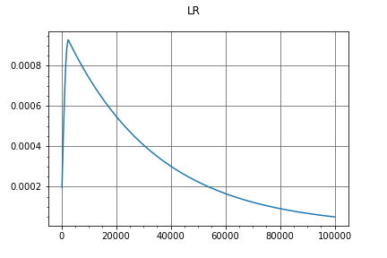
   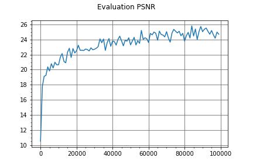

   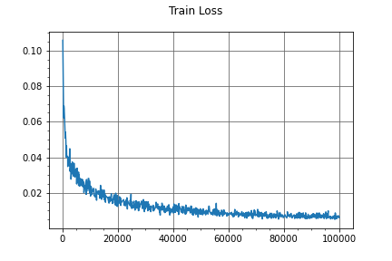
   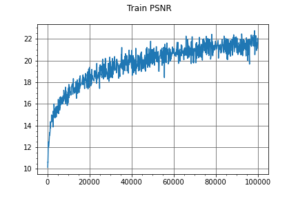

 
Video:
 

[//]: # (<video controls>)

[//]: # (    <source src="misc/results/trex/video.mp4" type="video/mp4">)

[//]: # (</video>)
 
Depth:
 

[//]: # (<video controls>)

[//]: # (<source src="misc/results/trex/depth.mp4" type="video/mp4">)

[//]: # (</video>)
 
Normals:
 

[//]: # (<video controls>)

[//]: # (<source src="misc/results/trex/normals.mp4" type="video/mp4">)

[//]: # (</video>)

### Blender - Lego

   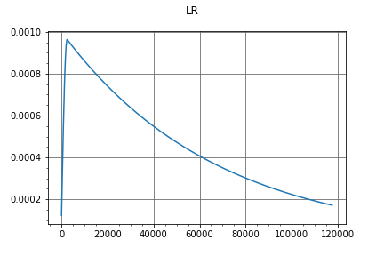
   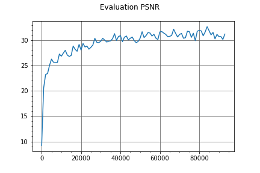

   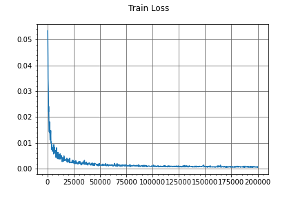
   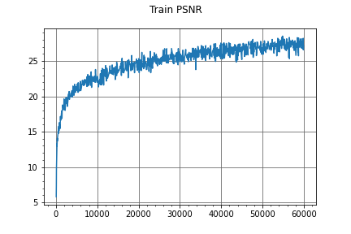

Video:
 

[//]: # (<video controls>)

[//]: # (    <source src="misc/results/lego/video.mp4" type="video/mp4">)

[//]: # (</video>)
 
Depth:
 

[//]: # (<video controls>)

[//]: # (    <source src="misc/results/lego/depth.mp4" type="video/mp4">)

[//]: # (</video>)
 
Normals:
 

[//]: # (<video controls>)

[//]: # (    <source src="misc/results/lego/normals.mp4" type="video/mp4">)

[//]: # (</video>)

### Multicam - Mic

   
   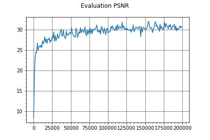

   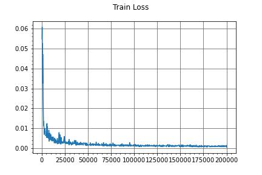
   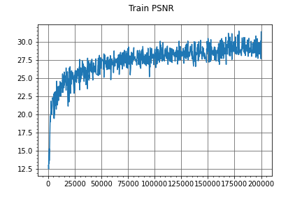

Video:
 

[//]: # (<video controls>)

[//]: # (    <source src="misc/results/mic/video.mp4" type="video/mp4">)

[//]: # (</video>)
 
Depth:
 

[//]: # (<video controls>)

[//]: # (    <source src="misc/results/mic/depth.mp4" type="video/mp4">)

[//]: # (</video>)
 
Normals:
 

[//]: # (<video controls>)

[//]: # (    <source src="misc/results/mic/normals.mp4" type="video/mp4">)

[//]: # (</video>)

## References/Contributions

* Thanks to [Nina](https://github.com/ninaahmed) for helping with the code
* [Original NeRF Code in Tensorflow](https://github.com/bmild/nerf)
* [NeRF Project Page](https://www.matthewtancik.com/nerf)
* [NeRF: Representing Scenes as Neural Radiance Fields for View Synthesis](https://arxiv.org/abs/2003.08934)
* [Original mip-NeRF Code in JAX](https://github.com/google/mipnerf)
* [mip-NeRF Project Page](https://jonbarron.info/mipnerf/)
* [Mip-NeRF: A Multiscale Representation for Anti-Aliasing Neural Radiance Fields](https://arxiv.org/abs/2103.13415)
* [nerf_pl](https://github.com/kwea123/nerf_pl)